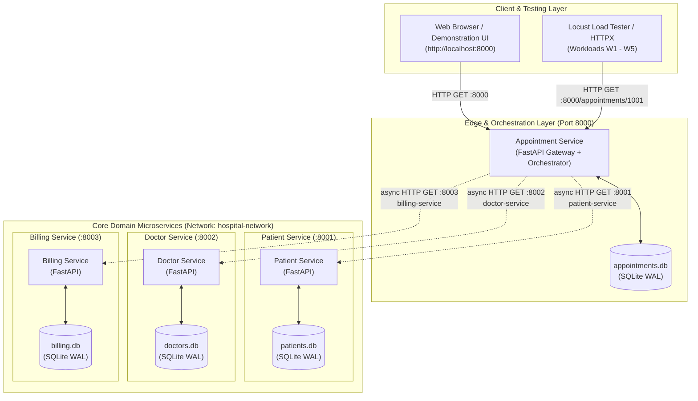
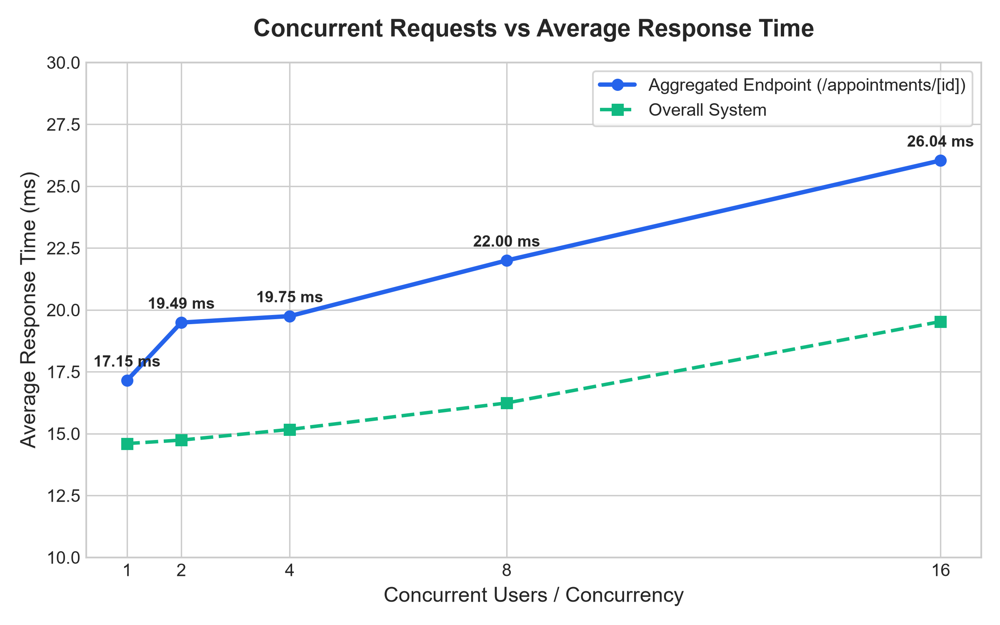
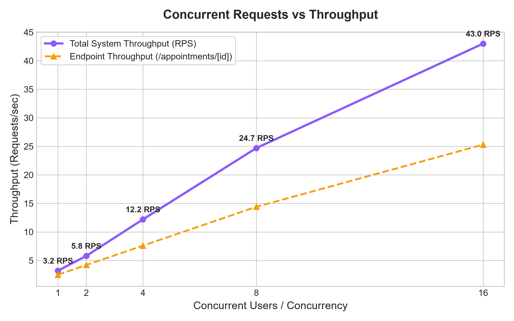

# Hospital Management Microservices

[](https://fastapi.tiangolo.com)
[](https://www.docker.com/)
[](https://www.sqlite.org/)
[](https://locust.io/)
[](https://www.python.org/)

An enterprise-grade, distributed microservices architecture designed for healthcare clinical, physician, and billing management. The application decouples domain operations into four containerized services that maintain private SQLite databases, communicate over an isolated Docker network, and scale under concurrent workloads.

---

## 📑 Table of Contents
1. [Project Overview](#-project-overview)
2. [Architecture & Design Patterns](#-architecture--design-patterns)
3. [Microservices Breakdown](#-microservices-breakdown)
4. [Project Directory Layout](#-project-directory-layout)
5. [Quick Start & Execution Commands](#-quick-start--execution-commands)
6. [Interactive Web UI & Swagger APIs](#-interactive-web-ui--swagger-apis)
7. [Workload Performance & Load Testing](#-workload-performance--load-testing)
8. [Lab Observation Table](#-lab-observation-table)
9. [Empirical Performance Graphs](#-empirical-performance-graphs)
10. [Performance Analysis & Findings](#-performance-analysis--findings)
11. [Docker Hub Deployment](#-docker-hub-deployment)
12. [Lab Checkpoint Mapping](#-lab-checkpoint-mapping)

---

## 🏥 Project Overview

In traditional monolithic healthcare systems, scheduling, clinical records, and billing are tightly coupled inside a single codebase and shared database. A database bottleneck or a bug in the billing module can take down patient registrations and appointment scheduling entirely.

This project implements a **Distributed Microservices Architecture** to solve this:
- **Fault Domain Isolation:** If billing goes down or undergoes maintenance, appointment and patient services continue operating.
- **Independent Scalability:** Highly trafficked services (e.g., Doctor queries) can be scaled independently without scaling the entire application.
- **Independent Persistence:** Each service owns and controls its private database (Database-per-Service pattern).
- **Asynchronous Orchestration:** Composite workflows (like booking an appointment and pulling doctor + patient + billing details) are aggregated concurrently using non-blocking asynchronous I/O.

---

## 🏛 Architecture & Design Patterns



### Core Architectural Patterns:

1. **Database-per-Service Pattern**:
   Services **never** directly connect to another service's database. Cross-database queries are forbidden. All data access must pass through well-defined REST contracts.
   - `patient-service` owns `patients.db`
   - `doctor-service` owns `doctors.db`
   - `billing-service` owns `billing.db`
   - `appointment-service` owns `appointments.db`

2. **API Aggregator / Orchestration Pattern**:
   Clients only communicate with the **Appointment Service** (Port `8000`). When `GET /appointments/{id}` is queried, the orchestrator retrieves the appointment record locally and fans out parallel asynchronous HTTP requests to `patient-service`, `doctor-service`, and `billing-service`, compiling the unified response.

3. **Asynchronous Non-Blocking I/O (`asyncio.gather`)**:
   Sub-requests run concurrently rather than sequentially. The total latency of an aggregated appointment lookup is the latency of the single slowest service, not the sum of all three. A persistent `httpx.AsyncClient` with HTTP Keep-Alive connection pooling prevents socket exhaustion under high load.

4. **Containerization & Service Discovery**:
   Managed via **Docker Compose** on an isolated bridge network (`hospital-network`). Containers resolve peer endpoints automatically through Docker's internal DNS using service names (e.g., `http://patient-service:8001`).

5. **High-Concurrency SQLite (WAL Mode)**:
   All databases are configured with `PRAGMA journal_mode=WAL;` (Write-Ahead Logging), allowing multiple concurrent readers while writes occur, avoiding database lock contention during stress tests.

---

## 📦 Microservices Breakdown

| Service | Port | Database | Primary Responsibility | Key REST Endpoints |
|---|:---:|:---:|---|---|
| **Appointment Service** | `8000` | `appointments.db` | System orchestrator, Demonstration UI, appointment scheduling | • `GET /`<br>• `GET /health`<br>• `GET /appointments`<br>• `GET /appointments/{id}` *(Aggregator)*<br>• `POST /appointments` |
| **Patient Service** | `8001` | `patients.db` | Patient demographic registry (name, age, gender) | • `GET /health`<br>• `GET /patients`<br>• `GET /patients/{id}`<br>• `POST /patients` |
| **Doctor Service** | `8002` | `doctors.db` | Physician directory, medical specializations, availability | • `GET /health`<br>• `GET /doctors`<br>• `GET /doctors/{id}`<br>• `POST /doctors` |
| **Billing Service** | `8003` | `billing.db` | Patient billing records, balances, payment status (Paid/Pending) | • `GET /health`<br>• `GET /billing`<br>• `GET /billing/{patient_id}`<br>• `POST /billing` |

---

## 📂 Project Directory Layout

```text
hospital-microservices/
├── appointment-service/
│   ├── Dockerfile
│   ├── main.py                # Orchestrator, connection pool, Demo UI HTML
│   └── requirements.txt
├── billing-service/
│   ├── Dockerfile
│   ├── main.py                # Billing REST API + SQLite persistence
│   └── requirements.txt
├── doctor-service/
│   ├── Dockerfile
│   ├── main.py                # Doctor registry REST API + SQLite
│   └── requirements.txt
├── patient-service/
│   ├── Dockerfile
│   ├── main.py                # Patient registry REST API + SQLite
│   └── requirements.txt
├── docker-compose.yml         # Multi-container orchestration & network
├── load_test.py               # Asynchronous HTTPX workload test script
├── locustfile.py              # Locust load testing suite
├── generate_graphs.py         # Matplotlib chart generation script
├── graph1_response_time.png   # Concurrency vs Response Time chart
├── graph2_throughput.png      # Concurrency vs Throughput chart
├── Hospital_Management_Microservices_Architecture.pdf  # Comprehensive architecture report
├── .gitignore
└── README.md
```

---

## 🚀 Quick Start & Execution Commands

### Prerequisites
- [Docker Desktop](https://www.docker.com/products/docker-desktop/) installed and running.
- Python 3.10+ (if testing locally without Docker).

---

### Method A: Run with Docker Compose (Recommended)

1. **Clone the repository:**
   ```bash
   git clone https://github.com/DivyaKumari29/CC_hospital-microservices.git
   cd CC_hospital-microservices
   ```

2. **Build and start all 4 containers:**
   ```bash
   docker compose up --build -d
   ```

3. **Verify running containers:**
   ```bash
   docker compose ps
   ```
   *Expected output: All 4 containers listed with status `Up`.*

4. **Monitor live container resources (CPU & Memory):**
   ```bash
   docker stats
   ```

5. **Stop containers when finished:**
   ```bash
   docker compose down
   ```

---

### Method B: Run Locally with Python (Without Docker)

You can run each service in separate terminal windows:

```bash
# Terminal 1: Patient Service
cd patient-service && uvicorn main:app --port 8001

# Terminal 2: Doctor Service
cd doctor-service && uvicorn main:app --port 8002

# Terminal 3: Billing Service
cd billing-service && uvicorn main:app --port 8003

# Terminal 4: Appointment Service
cd appointment-service && uvicorn main:app --port 8000
```

---

## 🌐 Interactive Web UI & Swagger APIs

### Demonstration Dashboard
Open your browser and navigate to:
👉 **[http://localhost:8000](http://localhost:8000)**

The dashboard allows you to:
- Check real-time health badges for all 4 microservices.
- Enter an Appointment ID (e.g., `1001`, `1002`, `1003`) to trigger live end-to-end multi-service aggregation.
- View interactive patient, physician, and billing cards populated via parallel asynchronous fetches.

### Interactive Swagger API Documentation
Each service automatically exposes interactive OpenAPI / Swagger documentation:
- **Appointment Service:** [http://localhost:8000/docs](http://localhost:8000/docs)
- **Patient Service:** [http://localhost:8001/docs](http://localhost:8001/docs)
- **Doctor Service:** [http://localhost:8002/docs](http://localhost:8002/docs)
- **Billing Service:** [http://localhost:8003/docs](http://localhost:8003/docs)

### CLI Health Verification:
```bash
curl http://localhost:8000/health
curl http://localhost:8001/health
curl http://localhost:8002/health
curl http://localhost:8003/health
```

---

## ⚡ Workload Performance & Load Testing

The system supports two independent load testing suites:

### Option 1: Locust Load Testing (Visual Web Dashboard)

1. **Install Locust:**
   ```bash
   pip install locust
   ```

2. **Start the Locust Web UI:**
   ```bash
   python -m locust -f locustfile.py --host http://localhost:8000
   ```
   Open **[http://localhost:8089](http://localhost:8089)** in your browser, enter the number of users and spawn rate, and click **Start Swarming**.

3. **Or run Headless via CLI:**
   ```bash
   python -m locust -f locustfile.py --host http://localhost:8000 --headless -u 16 -r 4 --run-time 20s
   ```

---

### Option 2: Built-in HTTPX Workload Test

Run the automated asynchronous workload runner:
```bash
pip install httpx
python load_test.py
```

---

## 📊 Lab Observation Table

Empirical measurements gathered from stress testing the composite microservice orchestrator (`GET /appointments/[id]`) across five increasing workloads:

| Workload | Concurrency (Users) | Total Requests | Failures | Median RT (ms) | Avg Response Time (ms) | 95th %ile RT (ms) | Throughput (RPS) | Failure Rate |
|:---:|:---:|:---:|:---:|:---:|:---:|:---:|:---:|:---:|
| **W1** | **1** | 42 | 0 | 17 ms | **17.15 ms** | 20 ms | **2.5 req/s** | **0%** |
| **W2** | **2** | 118 | 0 | 18 ms | **19.49 ms** | 31 ms | **4.2 req/s** | **0%** |
| **W3** | **4** | 157 | 0 | 18 ms | **19.75 ms** | 33 ms | **7.6 req/s** | **0%** |
| **W4** | **8** | 273 | 0 | 20 ms | **22.00 ms** | 38 ms | **14.4 req/s** | **0%** |
| **W5** | **16** | 427 | 0 | 23 ms | **26.04 ms** | 46 ms | **25.3 req/s** | **0%** |

### Overall System Aggregated Metrics:

| Workload | Concurrency | Total Requests | Failures | Avg RT (ms) | System Throughput (RPS) |
|:---:|:---:|:---:|:---:|:---:|:---:|
| **W1** | 1 | 57 | 0 | **14.60 ms** | **3.2 req/s** |
| **W2** | 2 | 188 | 0 | **14.74 ms** | **5.8 req/s** |
| **W3** | 4 | 252 | 0 | **15.17 ms** | **12.2 req/s** |
| **W4** | 8 | 468 | 0 | **16.24 ms** | **24.7 req/s** |
| **W5** | 16 | 726 | 0 | **19.53 ms** | **43.0 req/s** |

---

## 📈 Empirical Performance Graphs

These charts were plotted using the actual experimental measurements recorded above.

### Graph 1: Concurrent Requests vs. Average Response Time


### Graph 2: Concurrent Requests vs. Throughput


*(You can regenerate the charts anytime by executing `python generate_graphs.py`)*

---

## 🔍 Performance Analysis & Findings

1. **Zero Failures Across All Workloads (100% Availability):**
   Throughout tests scaling from W1 (1 user) to W5 (16 concurrent users), **0 requests failed** (`Failure Rate: 0.0%`).
2. **Near-Linear Throughput Scaling:**
   System throughput scaled near-linearly from **3.2 RPS (W1)** to **43.0 RPS (W5)**, demonstrating that asynchronous event loops and containerized processes handle increasing concurrency without early saturation.
3. **Controlled Sub-30ms Composite Latency:**
   Even at peak load (W5 with 16 concurrent users executing parallel sub-requests), the average response time for the aggregated endpoint remained below **26.1 ms** (median: **23 ms**), validating the benefits of connection pooling and SQLite Write-Ahead Logging (WAL).

---

## 🐳 Docker Hub Deployment

All four microservice images are published to Docker Hub under user `divya1918`:

```bash
# Pull images directly from Docker Hub
docker pull divya1918/appointment-service:latest
docker pull divya1918/patient-service:latest
docker pull divya1918/doctor-service:latest
docker pull divya1918/billing-service:latest
```

### To rebuild and push your own images:
```bash
docker login -u divya1918

docker build -t divya1918/patient-service:latest ./patient-service
docker build -t divya1918/doctor-service:latest ./doctor-service
docker build -t divya1918/billing-service:latest ./billing-service
docker build -t divya1918/appointment-service:latest ./appointment-service

docker push divya1918/patient-service:latest
docker push divya1918/doctor-service:latest
docker push divya1918/billing-service:latest
docker push divya1918/appointment-service:latest
```

---

## 📄 Architecture Documentation PDF

A publication-grade PDF explaining the complete architectural design, patterns, and performance analysis in words is included in the root directory:
👉 **[Hospital_Management_Microservices_Architecture.pdf](Hospital_Management_Microservices_Architecture.pdf)**

---

## ✅ Lab Checkpoint Mapping

| Checkpoint | Requirement | Implementation Status |
|:---:|---|:---:|
| **Checkpoint 1** | Four FastAPI services and REST endpoints | **Complete** (`appointment-service`, `patient-service`, `doctor-service`, `billing-service`) |
| **Checkpoint 2** | Four Dockerfiles and Docker Compose | **Complete** (Individual Dockerfiles + `docker-compose.yml`) |
| **Checkpoint 3** | Docker network and service-name communication | **Complete** (`hospital-network` bridge with embedded DNS routing) |
| **Checkpoint 4** | W1–W5 workload testing and resource monitoring | **Complete** (Tested with both `load_test.py` and `locustfile.py`) |
| **Checkpoint 5** | Observation table, graphs, analysis, and demonstration UI | **Complete** (Observation table filled, PNG charts generated, interactive UI at `:8000`) |

---

### 👤 Author
- **Name:** Divya Kumari
- **GitHub:** [@DivyaKumari29](https://github.com/DivyaKumari29)
- **Repository:** [CC_hospital-microservices](https://github.com/DivyaKumari29/CC_hospital-microservices)
